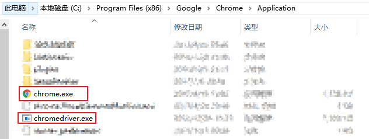
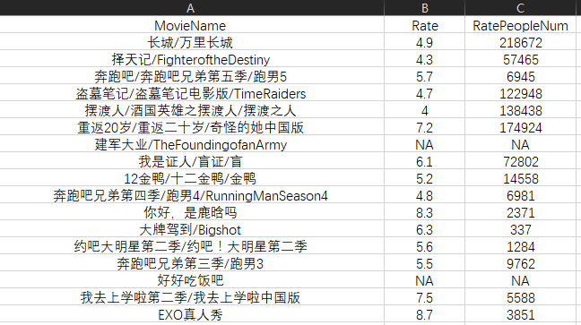

# 初探 RSelenium —— 基于豆瓣电影的爬虫实例

使用 [RSelenium][1] 包可通过 R 实现对浏览器的自动控制，完成诸如“点击”，“输入”等操作，从而爬取动态页面，解放你的双手！ 

本文基于 [豆瓣电影][2] 网站的爬虫实例， 对 [RSelenium][1] 包的使用做了初步的介绍。

## 工具准备

- JAVA：安装 JAVA
- Selenium Server：下载 selenium-server-standalone-版本号.jar （本文使用的是 3.4.0 版本）
- Chrome：安装 Chrome
- ChromeDriver：下载 chromedrive.exe

 *注：*下载的 chromedriver.exe 需放置在 Chrome 浏览器的安装目录下，即和 chrome.exe 放在同一个文件目录下。并将该目录添加入 **环境变量** 中。

一般 Chrome 的默认安装路径为：C:\Program Files (x86)\Google\Chrome\Application 。

<div align=center>



</div>

- SelectorGadget ：[ ~~非必需~~ ] Chrome 扩展，可用于定位网页元素的 xpath 。不过，也可以用 Chrome 浏览器在网页右键选项卡中的“检查” 功能（快捷键：F12）。 
- 所需 R 包：
  `RSelenium` 包：实现对浏览器行为的自动控制
  `rvest` 包：读取网页，定位网页元素并提取文本
  `stringr` 包：利用正则表达式进行字符串处理

## Let's do it !

本文以“鹿晗”作为关键词（ ~~真爱粉们不要太较真~~ ），搜索其出演过的电影，最终整理出电影名、评分信息和评价人数表。

1. 启动 Selenium Server

在所下载的 selenium-server-standalone-3.4.0.jar 文件目录下打开命令行，输入以下命令以启动Selenium Server ：

  ```shell
  java -jar selenium-server-standalone-3.4.0.jar
  ```


你也可以把这个命令存成后缀为 `.cmd` 的文件放在该文件目录下，这样下次只需双击运行即可。

2. 在 R 中连接 Server ，打开浏览器和目标网页

  ```R
  # 载入包
  library(RSelenium)
  library(rvest)
  library(stringr)
  # 连接 Server
  remDr <- remoteDriver(remoteServerAddr = "127.0.0.1" ,
  	port = 4444,
  	browserName = "chrome"
  )
  # 打开浏览器
  remDr$open()
  # 打开目标网页
  remDr$navigate("https://movie.douban.com/")
  ```

是不是发现，运行代码后自动启动了 Chrome ，并打开了 [豆瓣电影][2] ？！有没有一点紧张和小刺激？！😎

3. 定位网页元素，并向其传入参数

 `RSelenium` 包可通过 `name` 、 `id` 、 `class` 、 `css-selectors` 、 `xpath` 对网页元素进行定位。本文尽可能多地采取不同的方法来展示如何使用它们。

<div align=center>


</div>

可以看到，我们需要定位到搜索框。使用 SelectorGadget 或者浏览器的“检查”功能，得到该搜索框的 `name` 为 `search_text` 。

在定位到搜索框后，需要传入 `keyword` 并”回车“，从而实现搜索。

-  `findElement` ：定位符合条件的网页元素 

-  `sendKeysToElement` ：传入参数

  ```R
  # 设置搜索词
  keyword<- "鹿晗"
  # 定位网页元素
  SearchBox <- remDr$findElement(using='name', value='search_text')
  # 传入关键词和回车
  SearchBox$sendKeysToElement(list(keyword, key = 'enter'))
  ```

现在网页应该变成了”鹿晗“所出演的电影列表了。

<div align=center>


</div>

4. 读取网页，得到所需元素的文本

首先，我们定位到每一部电影。通过浏览器的“检查”功能，可以看出每部电影的 `class=”pl2“` 。定位到每部电影之后，提取其中的信息即可。

-  `getElementAttribute` ：得到网页信息

  接下来就是静态网页的爬虫套路了，使用 `rvest` 包和 `stringr` 包里的函数即可。

-  `read_html` ：读取网页

-  `html_nodes` ：定位元素

-  `html_text` ：得到元素文本

-  `str_replace_all` 、 `str_extract` ：字符串处理

  ```R
  # 传入网页中所有的电影元素，将提取文本过程写成 MovieDataFunc 函数
  MovieDataFunc<-function(MovieList)lapply(MovieList,function(i){
    		# 读取每部电影的元素
   		 doc<-i$getElementAttribute("outerHTML")[[1]]%>%
          	read_html()
          # 得到电影名 name
          name<-doc%>%
          	html_nodes("a")%>%
          	html_text()%>%
          	str_replace_all(pattern="\s",replacement="")
          # 得到评分 rate
          rate<-doc%>%
          	html_nodes("span.rating_nums")%>%
          	html_text()
          # 得到评分人数 pl
          pl<-doc%>%
          	html_nodes("span.pl")%>%
          	html_text()%>%
          	str_extract(pattern="[:digit:]+")
          # 如果缺少评分或评分人数，则设置其为 NA
          rate<-ifelse(identical(rate,character(0)),NA,rate)
          pl<-ifelse(identical(pl,character(0)),NA,pl)
          # 返回电影名、评分和评分人数
          return(c(name,rate,pl))
        }
  )
  # 定位到第一页的所有电影元素
  MovieList <- remDr$findElements('class','pl2')
  # 得到第一页的电影信息
  MovieData<-MovieDataFunc(MovieList)
  ```

5. 跳转到”下一页“，爬取所有页信息

将第一页的结果爬取完后，我们需要跳转到下一页，实现对所有搜索结果的爬取。

因此，需要判断还有多少页待爬取，遍历剩下的网页即可。

<div align=center>


</div>

图中，"第二页"所对应的 `xpath` 为 `//*[@id="content"]/div/div[1]/div[3]/a` ；”后页“所对应的 `class="next"` ，我们使用 `css-selectors` 定位到它。

-  `findElements` ：定位所有符合条件的网页元素

-  `clickElement` ：点击

  ```R
  # 得到剩余网页信息
  RemainPage <- remDr$findElements('xpath','//*[@id="content"]/div/div[1]/div[3]/a')
  # 爬取剩余网页的电影信息
  for(i in 1:length(RemainPage)){
      # 定位到”后页“
      NextPage <- remDr$findElement('css', '[class="next"]')
      # 模拟“点击”行为
      NextPage$clickElement()
      # 定位到当前网页的所有电影元素
      MovieList <- remDr$findElements('class','pl2')
      # 爬取当前网页的所有电影信息
      MovieData<-c(MovieData,MovieDataFunc(MovieList))
  }
  ```

6. 后续工作

当爬取了所有网页的信息之后，我们应当对结果进行整理，并储存。同时，关闭进程，退出浏览器。

-  `quit` ：关闭进程，退出浏览器

  ```R
  # 将 MovieData 的格式改为数据框，并更改列名
  MovieData<-data.frame(t(sapply(MovieData,c)),stringsAsFactors = F)
  colnames(MovieData)<-c("MovieName","Rate","RatePeopleNum")
  # 创建 output 文件夹储存爬取结果，并将结果储存至相应的 .csv 文件中
  if(!file.exists("output"))dir.create("output")
  write.csv(MovieData,paste0("output/",keyword,"_moviedata.csv"),row.names = F)
  # 关闭进程，退出浏览器
  remDr$quit()
  ```

部分爬取结果如下图所示：

<div align=center>



</div>

7. 题外话

我们再做点有意思的工作~ 😜

在 `cmd` 中运行 `Rscipt` 命令可以运行 R 的脚本，并传入参数。我们只需要把 `keyword<- "鹿晗"` 改成 `keyword<- commandArgs(T)` 。

-  `commandArgs` ：在 `Rscript` 命令中传入参数

[ ~~非必需~~ ] 考虑到本人在 RStudio 中包安装路径并非与 R 默认的包安装路径相同，为了在运行 `Rscipt` 命令时，顺利载入所需的包，还需要在脚本开头添加所需加载包的位置。

此外，由于在运行 `Rscipt` 命令时，出现了缺失函数的错误，还需要额外载入 `methods` 包。

添加下列代码即可：

  ```R
  # 添加所需 R 包位置
  .libPaths( unique(c( .libPaths(), "Your own R packages file folder") ))
  # 载入额外的 methods 包
  library(methods)
  # 设定运行 Rscript 命令时传入参数
  keyword<- commandArgs(T)
  ```

将该 R 脚本文件储存为 `Crawler_DoubanMovie.R` 。这样一来，你只需在 R 脚本文件所在文件目录下打开命令行工具，输入如下命令，就可以完成整个爬取工作，并得到输出的 `.csv` 文件了：

  ```shell
  Rscript Crawler_DoubanMovie.R 鹿晗
  ```
---

> 你可以在本人的 [github][3] 上看到这个实例的完整代码。
> 
> 本文作者：[Vector][4]

[1]: https://cran.r-project.org/web/packages/RSelenium/vignettes/RSelenium-basics.html

[2]: https://movie.douban.com

[3]: https://github.com/VectorF

[4]: https://vectorf.github.io

